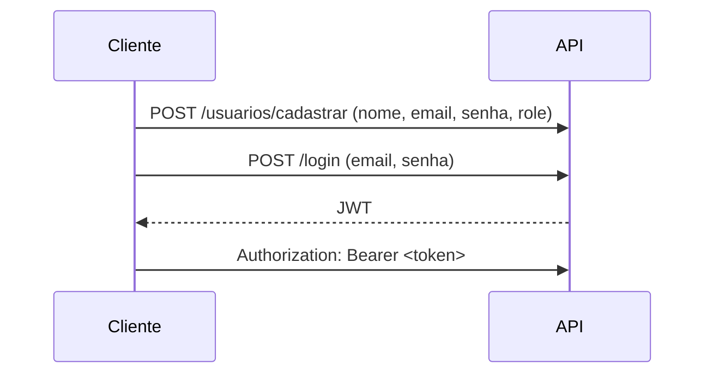

# Projeto Java • Spring Boot + JWT

> **Atividade acadêmica** — API RESTful protegida com Spring Security + JWT e controle de acesso por *roles* (**ADMIN** & **USER**).

---

## ✨ Visão geral

Este projeto demonstra como:

1. Cadastrar e autenticar usuários via JSON Web Token (JWT);
2. Definir *roles* no ato do cadastro;
3. Restringir endpoints com Spring Security;
4. Permitir que **ADMIN** liste, edite e delete qualquer usuário, enquanto **USER** gerencia apenas seu próprio perfil.

A avaliação da disciplina considera **funcionalidade**, **qualidade de código**, **frequência / clareza dos commits** e **documentação**.

---

## ⚙️ Stack

| Camada       | Tecnologia                           |
| ------------ | ------------------------------------ |
| Linguagem    | Java 17                              |
| Framework    | Spring Boot 3 (+ Spring Security 6)  |
| Autenticação | JWT (jjwt 0.11.5)                    |
| Persistência | Spring Data JPA + MySQL / PostgreSQL |
| Build        | Maven                                |

> **Dica 💡** — use Docker‑Compose para subir banco e app rapidamente (exemplo em `docker-compose.yml`).

---

## 🗂️ Estrutura

```
src/
 ├─ main/java/com/example
 │   ├─ controller  ← REST endpoints
 │   │    ├─dto         ← objetos de transferência
 │   ├─ model      ← entidades JPA
 │   │
 │   ├─ repository  ← Spring Data
 │   ├─ security    ← filtros, util e config JWT
 │   └─ service     ← regras de negócio
 └─ main/resources
     └─ application.properties
```

---

## 🚀 Executando localmente

### 1️⃣ Pré‑requisitos

* **JDK 17+**
* **Maven 3.9+**
* MySQL ︱ PostgreSQL em execução *(ou Docker)*

### 2️⃣ Configuração

1. Duplique `application-example.yml` ➡️ `application.yml` e ajuste:

   ```yml
   spring.datasource.url=jdbc:mysql://localhost/prova-java?createDatabaseIfNotExist=true
   spring.datasource.username={seu usuario}
   spring.datasource.password={sua senha}
   spring.jpa.hibernate.ddl-auto=update
   ```
2. Colo sua secrete key `src\main\java\com\example\prova_java\security\jwt\JwtUtil`

   ```
   private final String secretKey = "{Sua secret key}";
   ```
3. **Build & run**:

   ```bash
   mvn spring-boot:run
   ```
4. A API s[obe em ](http://localhost:8080)**[http://localhost:8080](http://localhost:8080)**.

---

## 🔐 Fluxo de autenticação



### Geração do token

`/login` retorna:

```json
{
  "token": "eyJhbGciOiJIUzI1NiIsInR5cCI6IkpXVCJ9…"
}
```

Inclua o header `Authorization` em cada requisição protegida:

```
Authorization: Bearer <token>
```

---

## 📑 Documentação dos endpoints

| Método | URL                   | Papel                   | Descrição                           |
| ------ | --------------------- | ----------------------- | ----------------------------------- |
| POST   | `/usuarios/cadastrar` | Público                 | Cadastro de usuário (define `role`) |
| POST   | `/login`              | Público                 | Autentica e devolve JWT             |
| GET    | `/usuarios`           | ADMIN                   | Lista todos os usuários             |
| GET    | `/usuarios/{id}`      | ADMIN \| USER (próprio) | Retorna usuário pelo id             |
| PUT    | `/usuarios/{id}`      | ADMIN \| USER (próprio) | Edita dados do usuário              |
| DELETE | `/usuarios/{id}`      | ADMIN                   | Deleta usuário                      |

Detalhes extras no arquivo **`openapi.yml`**.

---

## 🛠️ Desenvolvimento

### Scripts úteis

```bash
mvn test               # roda os testes
mvn prettier:write      # formata o código (plugin)
```

### Convenção de commits

* `feat:` nova funcionalidade
* `fix:` correção de bug
* `docs:` somente documentação
* `refactor:` refatoração sem mudar comportamento

> **Exemplo**: `feat: implementar endpoint GET /usuarios/{id}`
